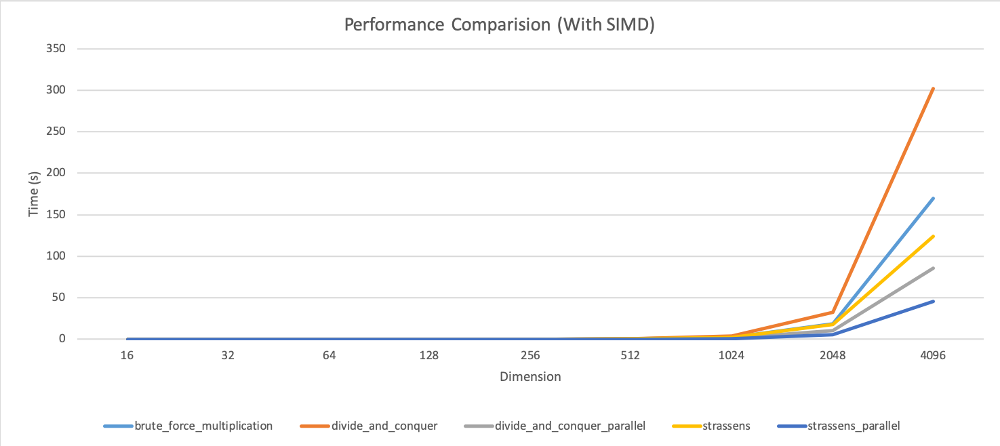
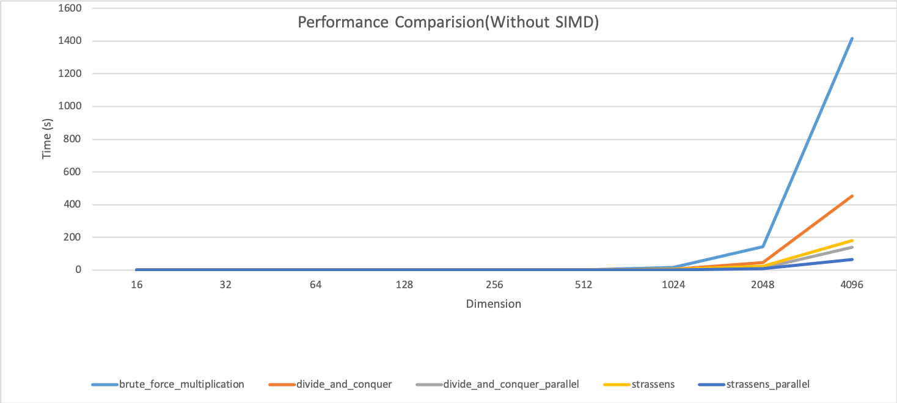
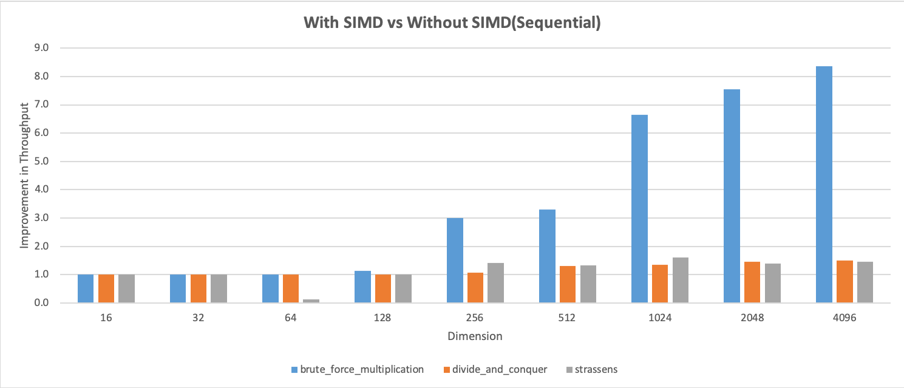
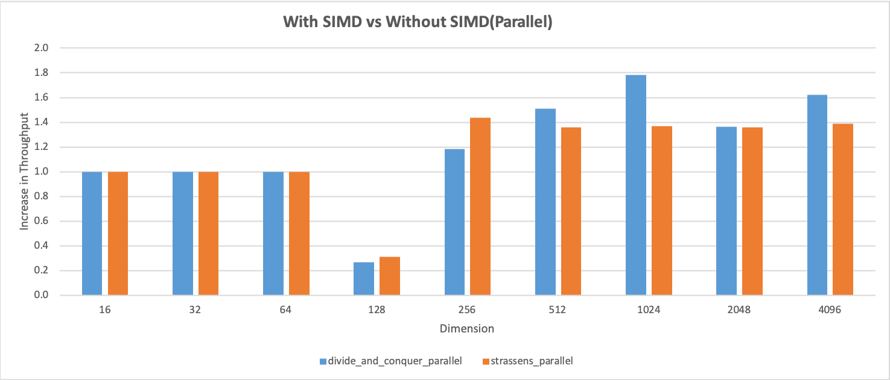

 Performance comparision of Matrix Multiplication Algorithms

September 2016

# Introduction
A methodical performance comparison of the Strassen’s Matrix Multiplication algorithm against the brute force and divide-and-conquer matrix multiplication approaches. Each algorithm was compared with its parallelized versions, and the performance was tested with and without <b>Single-Instruction-Multiple-Data (SIMD) optimizations</b>. The code for all versions of each algorithm was written in C. A short paper containing the outcomes of the comparison was published at the IEEE Innovative Mechanisms for Industry Applications (ICIMIA) conference.

# Algorithms Used
- Standard inner product based row-col multiplication algorithm (Brute force Method)
- Divide-and-Conquer based multiplication algorithm O(n^3)
Strassen's recursive Divide-and-Conquer algorithm
- Parallelized Divide-and-Conquer multiplication algorithm O(n^3)
- Parallelized Strassen's recursive Divide-and-Conquer algorithm

# SIMD type
This implementation uses [<b>AVX2</b>](https://en.wikipedia.org/wiki/Advanced_Vector_Extensions).
 
Note: commented out in code, as it is not portable (uses calls specific to the compiler and hardware architecture).

# Hardware:

## Processor1
- Intel(R) Core(TM) i7-4700MQ CPU @ 2.40GHz
- Clock Speed - 2.34 GHz			
- Cores - 4			
- Threads - 8			
- L2 Cache - 256 KB Per Core			
- L3 Cache - 6.00 MB	

## Processor2
- Intel(R) Core(TM) i5-6600K CPU @ 3.50GHz			
- Clock Speed - 3.42 GHz			
- Cores - 4			
- Threads - 4			
- L2 Cache - 1024 KB Per Core			
- L3 Cache - 6.00 MB

# Performance Comparisions

